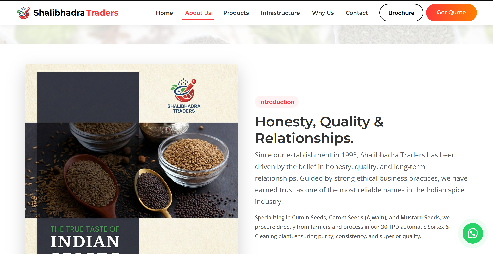

<div align="center">
  
  <h1 align="center">🌿 Shalibhadra Traders</h1>
  <p align="center">
    <em>Premium bulk cumin, ajwain, and mustard seed supplier from Gujarat, India — trusted since 1993.</em>
  </p>

  <p align="center">
    <a href="https://ap1311.github.io/Shalibhadra-Traders/">
      
    </a>
    
    
  </p>
</div>

---

<h3 align="center">➡️ Visit: <a href="https://ap1311.github.io/Shalibhadra-Traders/">Shalibhadra Traders Website</a></h3>

---

## 🚀 Overview

**Shalibhadra Traders** is a modern, responsive business website built for a long-established Indian spice trading company.

It presents the brand's legacy, product offerings, infrastructure capabilities, and contact pathways in a clean and conversion-focused format.

The site is designed to help wholesalers, distributors, and bulk buyers quickly understand:

- who the company is,
- what products are supplied,
- why the quality is reliable,
- and how to request a quote instantly.

## ✨ Core Features

### 🏢 Business-First Presentation
- Highlights company history and trust built since **1993**.
- Communicates credibility through quality-focused brand messaging.
- Structured for supplier discovery and lead generation.

### 🌾 Product Showcase
- Dedicated product visuals for:
  - **Cumin**
  - **Ajwain (Carom)**
  - **Mustard**
- Optimized for buyers comparing bulk spice options.

### 📱 Conversion & Contact UX
- Floating **WhatsApp CTA** for instant communication.
- Clear quote/contact-oriented sections.
- Fast access to business brochure (`assets/Brochure.pdf`).

### ⚡ Performance & SEO Foundations
- Semantic metadata and social preview tags (`Open Graph`, Twitter cards).
- Structured data (`schema.org`) for business discoverability.
- Lightweight static architecture with fast loading behavior.

## 🖼️ Screenshot

<div align="center">
  
</div>

> 📐 Screenshot resolution: **1366 × 768 (16:9 ratio)**

## 🧱 Project Structure

```text
Shalibhadra-Traders/
├── index.html
├── README.md
├── assets/
│   ├── about.png
│   ├── Brochure.pdf
│   ├── carom.png
│   ├── cumin.png
│   ├── infra.png
│   ├── logo.ico
│   ├── logo.png
│   ├── logo_HD.jpg
│   ├── mustard.png
│   └── Spices.jpg
└── pic/
    └── img1.png
```

## 💻 Installation & Usage

### Option 1: Use Live Version (Recommended)
Open directly in your browser:

➡️ **https://ap1311.github.io/Shalibhadra-Traders/**

### Option 2: Run Locally

1. Clone the repository:
   ```bash
   git clone https://github.com/ap1311/Shalibhadra-Traders.git
   cd Shalibhadra-Traders
   ```

2. Start a local static server:
   ```bash
   python3 -m http.server 8080
   ```

3. Open in browser:
   ```text
   http://localhost:8080
   ```

<details>
<summary><strong>Alternative Local Server (Node.js)</strong></summary>

```bash
npx serve .
```

</details>

## 🛠️ Tech Stack

- **Frontend:** HTML5, CSS3, Bootstrap 5, Vanilla JavaScript
- **Assets:** Product images, brand media, brochure PDF
- **Hosting:** GitHub Pages (static deployment)

## 📈 SEO & Branding Notes

This website includes business-oriented on-page SEO elements such as:

- descriptive title and meta tags,
- canonical URL,
- social sharing metadata,
- and JSON-LD business schema.

These help improve visibility and consistency across search and social platforms.

## 👤 Business Contact

**Shalibhadra Traders**

- 📞 Phone: `+91 94083 48629`
- 📧 Email: `shalibhadratraders1660@gmail.com`
- 📍 Location: APMC Mandal, Gujarat, India

---

## 👤 Author

**Aarav Shah**

- GitHub: https://github.com/aaravshah1311/
- Portfolio: https://aaravshah1311.is-great.net
- Email: aaravprogrammers@gmail.com

---

<div align="center">
  <sub>Built to represent trust, quality, and scale in Indian bulk spice trading.</sub>
</div>
